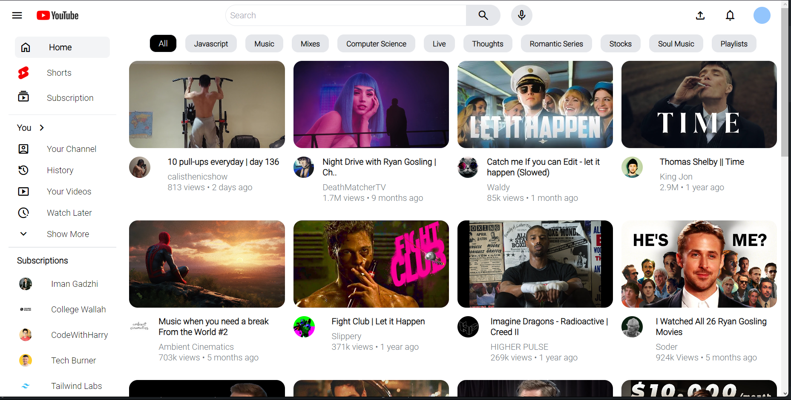

# YouTube Clone with Tailwind CSS

This project is a simple YouTube clone created using HTML, CSS, and Tailwind CSS. It mimics the basic layout and styling of the YouTube website.

## Technologies Used

- HTML
- CSS
- [Tailwind CSS](https://tailwindcss.com/)

## Preview

## Features

- Basic video player layout
- Tailwind CSS styling for a modern look

## Getting Started

### Prerequisites

- Make sure you have a modern web browser installed (e.g., Google Chrome, Mozilla Firefox).

## Acknowledgments
- Tailwind CSS for providing a utility-first CSS framework.
- YouTube for inspiration.

## Author
- SHIVA SHANKAR
- [Github](https://github.com/STXRSHIVA)
- [LinkedIn](https://www.linkedin.com/in/j-shiva-shankar-868562257/)
